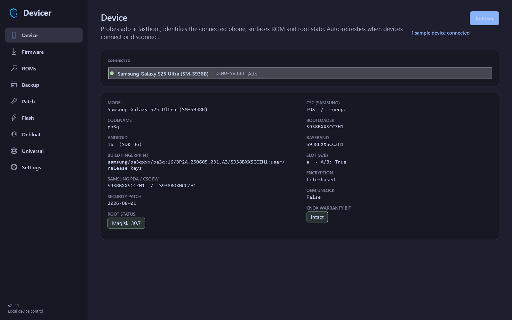
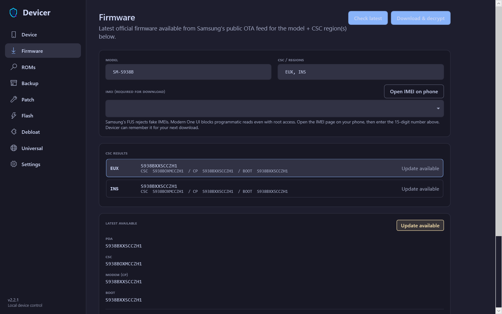
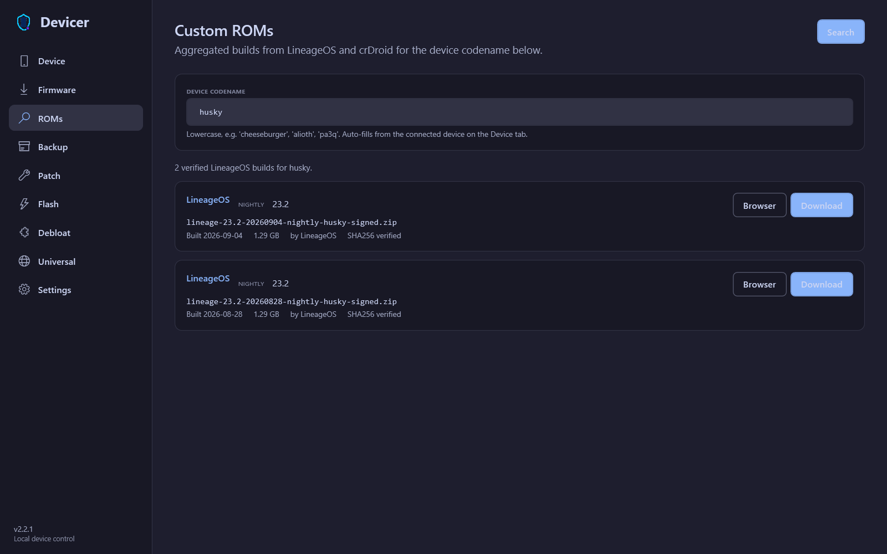
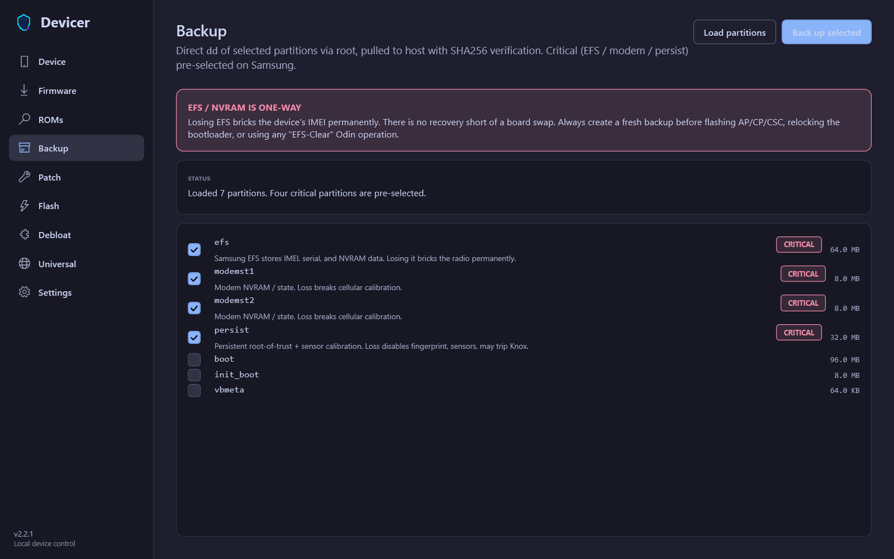
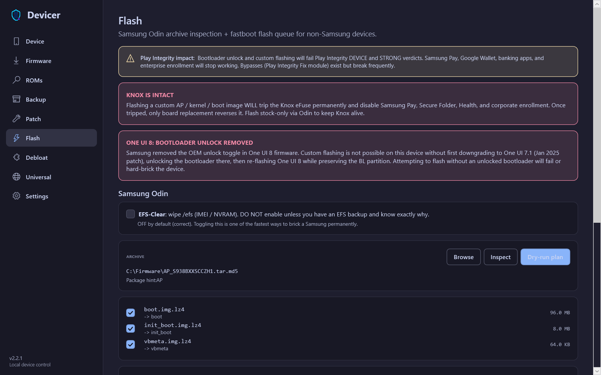

# Devicer

[](https://github.com/SysAdminDoc/Devicer/releases/tag/v2.2.1)
[](LICENSE)
[](#requirements)
[](#install)

Devicer is a Windows toolkit for Android device discovery, Samsung firmware, ROM downloads, partition backups, boot image patching, and guarded flashing. It keeps device work in one desktop app and puts the risky choices in plain sight before anything is written.

[**Download Devicer v2.2.1 for Windows x64**](https://github.com/SysAdminDoc/Devicer/releases/latest/download/Devicer-v2.2.1-win-x64.zip)

## See it in action



The Device view gathers the details you usually chase through separate ADB commands. The sample serial makes the representative capture easy to distinguish from a live phone.

| Firmware lookup | ROM discovery |
|---|---|
|  |  |

| Critical backup | Flash safety review |
|---|---|
|  |  |

These screenshots come from the production Windows executable on isolated desktops at 125% DPI. Capture mode uses representative data and disables hardware probing, so it never reads a connected phone.

## What it handles

| Workflow | What Devicer does |
|---|---|
| Device insight | Detects ADB, fastboot, recovery, sideload, bootloader, and Samsung Download mode. Reports model, build, root, encryption, slots, CSC, Knox, and bootloader state. |
| Official firmware | Checks Samsung's public FUS feed by model and CSC, compares the installed PDA, downloads the encrypted package, then decrypts it locally. |
| Custom ROMs | Searches LineageOS and crDroid by codename. Downloads stay in the app, with SHA-256 or MD5 verification when the source publishes a digest. |
| Backup and restore | Finds block partitions through root, preselects EFS and other critical data, verifies each backup, and checks hashes before restore. |
| Boot patching | Sends `boot.img` or `init_boot.img` to Magisk, KernelSU, or APatch. A PC-side Magisk patcher is available when the phone is not rooted. |
| Flash planning | Inspects Odin archives, builds dry runs, gates destructive Thor actions, and manages fastboot image queues with slot and AVB options. |

## Why use it

- One interface replaces a pile of terminal commands and browser tabs.
- Critical Samsung partitions are called out before a flash, with EFS clear disabled by default.
- External GPL tools run as separate processes. Devicer remains MIT licensed and each backend can be updated independently.
- Device data, cached firmware, manifests, and logs stay under your Windows profile. No Devicer account is required.

## Install

1. Download `Devicer-v2.2.1-win-x64.zip` from the [latest release](https://github.com/SysAdminDoc/Devicer/releases/latest).
2. Verify the matching SHA-256 file if you want to confirm the download.
3. Extract the ZIP and run `Devicer.exe`.
4. Connect a phone with a data-capable USB cable. Enable USB debugging, unlock the phone, and approve the computer when Android asks.

The Windows build is self-contained, so you do not need to install .NET. It is not code signed because no signing certificate is available for this project. Windows SmartScreen may show an unrecognized publisher notice. Check the published SHA-256 digest before running it.

## Requirements

- Windows 10 or Windows 11, x64
- Android SDK Platform Tools v37 or newer on `PATH`
- A data-capable USB cable and the correct OEM USB driver
- Root access for raw partition backup, restore, and on-device boot patching

Firmware lookup and ROM search can work without root. Flashing also depends on the target device, an unlocked bootloader where required, and a compatible backend such as Thor, Heimdall, or fastboot.

## Safety model

Devicer cannot make flashing risk-free. It can make the plan visible.

- Dry runs show the archive entries or fastboot images before execution.
- EFS clear starts off and requires an explicit choice.
- Knox, One UI bootloader restrictions, Play Integrity impact, and AVB choices are shown near the controls that matter.
- Restore checks the saved manifest and SHA-256 values before writing partitions.

Back up EFS, modem state, `persist`, and any device-specific calibration data before changing firmware. Never flash an image built for another model or bootloader revision.

## Build from source

Devicer uses C# with .NET 10 WPF and CommunityToolkit.Mvvm.

```powershell
dotnet restore Devicer.sln
dotnet test Devicer.sln -c Release
dotnet run --project src/Devicer.App -c Release
```

Build the release package locally:

```powershell
pwsh tools/build-release.ps1 -SelfContained
```

Recreate the brand assets and isolated-desktop screenshots:

```powershell
pwsh tools/build-brand-assets.ps1
dotnet run --project tools/Devicer.MarketingCapture -c Release -- `
  --app src/Devicer.App/bin/Release/net10.0-windows10.0.22621.0/Devicer.App.exe `
  --output assets/screenshots
```

## Project layout

```text
src/Devicer.Core/            Device models, services, parsers, and tool wrappers
src/Devicer.App/             WPF application, pages, themes, and view models
tests/Devicer.Core.Tests/    Unit and regression tests
tools/Devicer.Smoke/         Hardware and public-feed smoke commands
tools/Devicer.MarketingCapture/  Private-desktop screenshot runner
assets/brand/                Master identity, banner, social card, and icon family
assets/screenshots/          Current production UI captures
```

## Current limits

Devicer is an alpha release for experienced Android users. A wrong image, interrupted write, locked bootloader, or anti-rollback rule can leave a phone unbootable. Samsung firmware downloads still require a valid IMEI, and the availability of third-party tools can vary by device family.

## License

Devicer is available under the [MIT License](LICENSE). Thor Flash Utility and other optional tools keep their own licenses and run outside the Devicer process.
